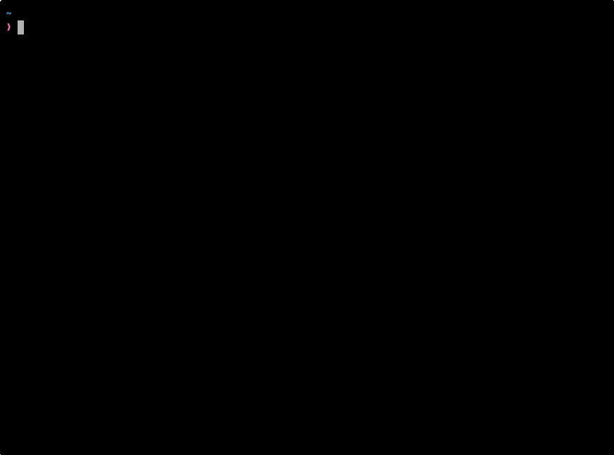

# wakeup-neo

Digital rain in x86_64 / aarch64 Linux assembly with multi-arch scratch image, ~10 KB.

## The Matrix has you

```sh
docker run --rm -it ghcr.io/zdk/hello-world
# or
docker run --rm -it warachet/hello-world
```

### Tags

Both registries (`ghcr.io/zdk/hello-world` and `warachet/hello-world`) carry the same tags:

| Tag | Type | Compressed |
|---|---|---|
| `:latest`, `:neo`, `:hello-neo` | multi-arch (amd64 + arm64) | ~4.4 kB |
| `:amd64` | single-arch | 1,109 B |
| `:arm64` | single-arch | 1,087 B |

Pick a single-arch tag if you only want one architecture on disk:

```sh
docker run --rm -it warachet/hello-world:arm64
docker run --rm -it warachet/hello-world:amd64
```

## Follow the white rabbit



## Knock, knock, Neo

```sh
docker build -t matrix .

# Specific arch
docker buildx build --platform linux/arm64 --load -t matrix:arm64 .
docker buildx build --platform linux/amd64 --load -t matrix:amd64 .
```
