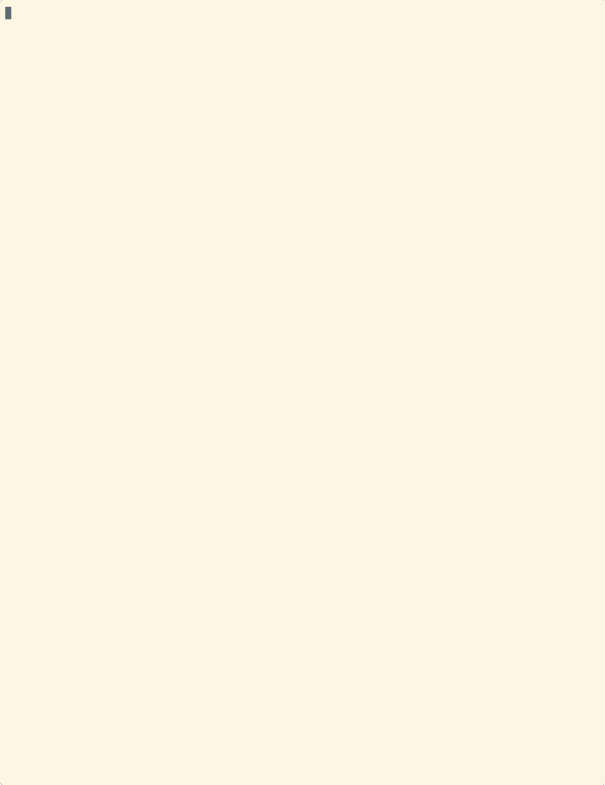

# wakeup-neo

Digital rain in x86_64 / aarch64 Linux assembly with multi-arch scratch image, ~10 KB.

## The Matrix has you

```sh
docker run warachet/hello-neo

```

Or

```sh
docker run --rm -it ghcr.io/zdk/matrix:wakeup-neo
```

## Follow the white rabbit



## Knock, knock, Neo

```sh
docker build -t matrix .

# Specific arch
docker buildx build --platform linux/arm64 --load -t matrix:arm64 .
docker buildx build --platform linux/amd64 --load -t matrix:amd64 .
```
